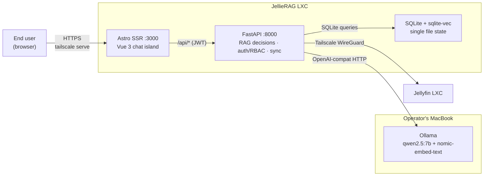
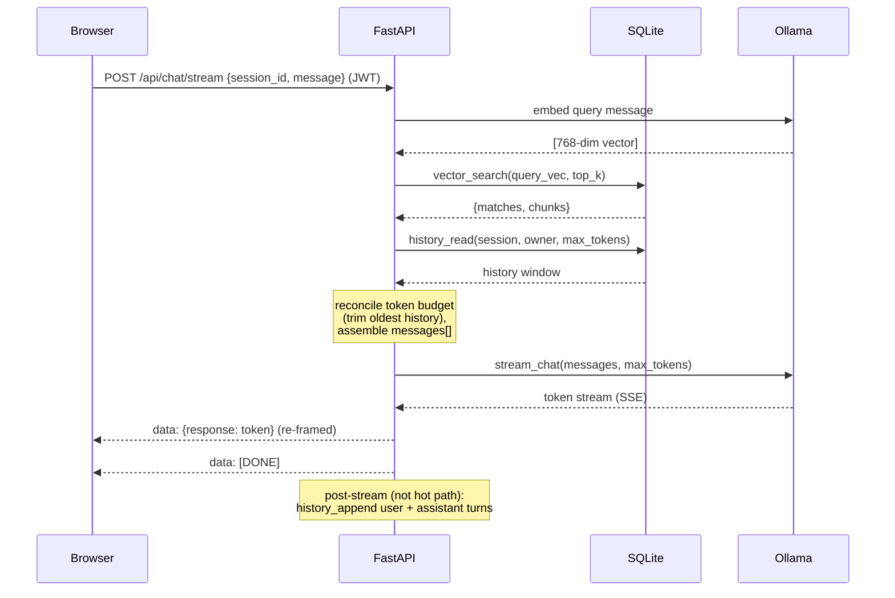
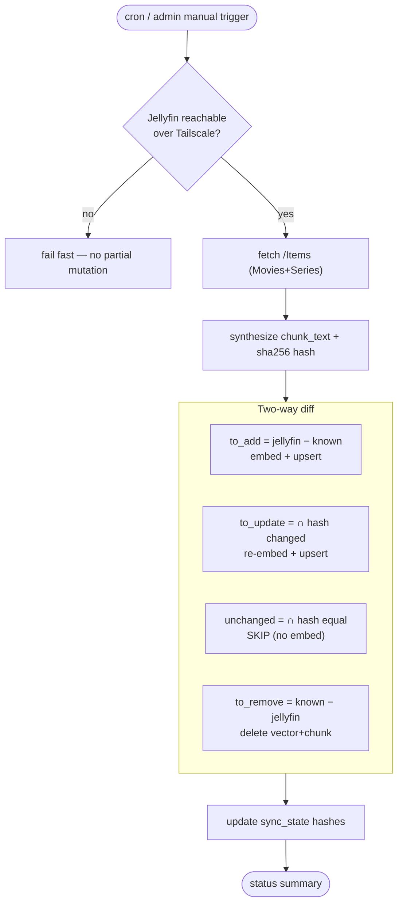

# JellieRAG: RAG System for Jellyfin Media Server with Role Based Access Control (RBAC)

> A self-hosted, privacy-conscious **Retrieval-Augmented Generation** assistant for your
> Jellyfin media library. Ask natural-language questions about your movies and series;
> get streaming answers with click-to-play deep links — fully local on your homelab with
> no cloud dependencies.

JellieRAG ingests Jellyfin metadata, embeds it into a **local sqlite-vec** semantic
index, and answers questions through a streaming chat UI powered by **Ollama** on your
MacBook over Tailscale. Everything stays inside your WireGuard mesh — zero public ingress.

---

## Table of contents

- [Why JellieRAG](#why-jellirag)
- [How it works (the 60-second version)](#how-it-works-the-60-second-version)
- [Architecture](#architecture)
- [Repository structure](#repository-structure)
- [Prerequisites](#prerequisites)
- [Development](#development)
- [Environment variables](#environment-variables)
- [API reference](#api-reference)
- [Data model](#data-model)
- [Security model](#security-model)
- [Deployment](#deployment)
- [Operations](#operations)
- [Verification checklist](#verification-checklist)
- [Project status & contributing](#project-status--contributing)

---

## Why JellieRAG

Three architectural principles shape everything:

1. **Fully local, zero cloud dependencies.** All data lives in a single SQLite database
   with co-located vector embeddings. AI operations use OpenAI-compatible HTTP clients
   (default: Ollama on your MacBook), so you control where your data goes.
2. **Single-file state.** Chunks, embeddings, conversation history, and user accounts all
   live in one SQLite file. Backup is a simple `.backup` operation — no managed services,
   no separate restore procedures.
3. **Deep links fail closed.** Click-to-play links are rooted at Tailscale/MagicDNS
   addresses. On the Tailnet they resolve; off it the hostname is NXDOMAIN — so
   recommending media requires no public homelab port.

---

## How it works (the 60-second version)

1. **Sync** fetches Jellyfin items over Tailscale, synthesizes a text chunk for each,
   embeds it via Ollama, and upserts the vector (sqlite-vec) + chunk text (SQLite) in a
   single transaction. It's **incremental** — a content-hash diff re-embeds only
   new/changed items and prunes removed ones.
2. **Chat** asks a question. FastAPI embeds the query, performs vector search in
   sqlite-vec, loads conversation history, reconciles a token budget, then streams the
   LLM answer from Ollama back to the browser as SSE.
3. **History** is private per user (`sessions.owner_email`), persisted in SQLite, and
   pruned on a TTL.

---

## Architecture

### Topology



### Responsibility split

| Component | Owns | Does **not** do |
|---|---|---|
| **backend** (FastAPI) | All RAG decisions: budget reconciliation, message assembly, deep-link templating, incremental sync, session prune, login/JWT, RBAC, argon2id hashing, account provisioning | Talk to Cloudflare APIs; store secrets |
| **frontend** (Astro + Vue 3) | SSR shell, login page, reactive streaming chat island, source chips, admin UI | Store secrets; make direct AI calls |

### Chat request — local execution



### Incremental library sync — two-way set difference



> `to_remove = known_ids − jellyfin_ids` is the step that catches media **deleted** from Jellyfin.
> Iterating only Jellyfin's response would silently miss deletions.

---

## Repository structure

```
jellirag/
├── apps/
│   ├── backend/                 # Python (uv) — FastAPI: RAG decisions + auth + sync
│   │   ├── pyproject.toml
│   │   ├── Dockerfile
│   │   ├── .dev.env.example
│   │   └── app/
│   │       ├── main.py              # FastAPI app + lifespan (DB, AI clients, scheduler)
│   │       ├── config/settings.py   # env → Settings
│   │       ├── routers/             # auth · chat · history · admin · sync
│   │       ├── services/            # ai_provider · db · jellyfin_client · sync_service · chunks · prompts · sse · scheduler · bootstrap
│   │       ├── budget/manager.py    # context-budget manager
│   │       └── security/            # jwt · passwords (argon2id) · deps (principal, RBAC, rate limit)
│   └── frontend/               # pnpm — Astro SSR + Vue 3 islands
│       ├── astro.config.mjs        # @astrojs/vue + @astrojs/node (standalone)
│       ├── Dockerfile
│       └── src/{pages,layouts,components,lib}/
├── deploy/
│   ├── docker-compose.yml       # LXC stack: frontend :3000 + backend :8000
│   ├── README.md                # Complete deployment guide
│   └── ollama-setup.md          # Ollama configuration on MacBook
├── packages/                    # shared workspace (minimal)
├── openspec/                    # change tracking (jellirag-local-pivot)
└── PRD.md                       # canonical product + technical reference
```

---

## Prerequisites

| Tool | Used by | Install |
|---|---|---|
| **Node.js** ≥ 22 + **pnpm** ≥ 9 | frontend | <https://nodejs.org>, `corepack enable` |
| **Python** ≥ 3.12 + **uv** | backend | <https://docs.astral.sh/uv/> |
| **Docker** + **docker-compose** | LXC deployment | <https://docs.docker.com/> |
| **Tailscale** | All components (tailnet-only access) | <https://tailscale.com> |
| **Proxmox** (or similar) | LXC hosting | <https://www.proxmox.com> |
| A **Jellyfin** server reachable over Tailscale | media source | <https://jellyfin.org> |
| **Ollama** on MacBook M4 Pro | LLM + embeddings | <https://ollama.com> |

---

## Development

Run the frontend and backend locally. Ollama should be running on your machine.

### 1. backend (FastAPI)

```bash
cd apps/backend
uv sync

cp .dev.env.example .env                # fill in env vars (Ollama URLs, Jellyfin, JWT_SECRET)

uv run uvicorn app.main:app --reload --port 8000
# health check:
curl http://localhost:8000/healthz   # → {"status":"ok"}
```

On startup the app:
- creates a shared `httpx.AsyncClient` for all outbound HTTP (fully async),
- initializes SQLite with migrations and sqlite-vec extension,
- constructs LLM and embeddings clients,
- runs the idempotent **bootstrap-admin** hook (seeds an admin only if the `users` table is empty
  and `BOOTSTRAP_ADMIN_EMAIL`/`BOOTSTRAP_ADMIN_PASSWORD` are set),
- starts the APScheduler jobs (cron sync + daily prune).

### 2. frontend (Astro + Vue)

```bash
cd apps/frontend
pnpm install

# Point the browser at the backend origin (empty = relative/same-origin):
export PUBLIC_API_BASE=http://localhost:8000
export PUBLIC_DEEPLINK_BASE=http://jellyfin.<tailnet>.ts.net:8096

pnpm dev                            # http://localhost:3000
pnpm build                          # SSR build → dist/server/entry.mjs
```

### Useful local checks

```bash
# Backend byte-compile + import smoke test
cd apps/backend && uv run python -m compileall -q app
cd apps/backend && uv run python -c "from app.main import app; print('ok')"

# Frontend production build
cd apps/frontend && pnpm build
```

---

## Environment variables

All secrets are injected at runtime (Docker env) — **never** baked into images or committed.

### backend — `apps/backend/.env`

| Variable | Required | Default | Purpose |
|---|---|---|---|
| `LLM_BASE_URL` | yes | — | OpenAI-compat LLM endpoint (default: Ollama) |
| `LLM_API_KEY` | yes | — | LLM provider API key (default: `ollama`) |
| `LLM_MODEL` | yes | — | LLM model name (default: `qwen2.5:7b`) |
| `EMBED_BASE_URL` | yes | — | OpenAI-compat embeddings endpoint (default: Ollama) |
| `EMBED_API_KEY` | yes | — | Embeddings provider API key (default: `ollama`) |
| `EMBED_MODEL` | yes | — | Embeddings model name (default: `nomic-embed-text`) |
| `EMBED_DIM` | no | `768` | Embedding dimension (must match model) |
| `LLM_TIMEOUT_SECONDS` | no | `5` | LLM connection timeout |
| `SQLITE_PATH` | no | `/var/jellirag/jellyrag.db` | SQLite database path |
| `SYNC_EMBED_CONCURRENCY` | no | `4` | Bounded concurrency for batch embeddings |
| `JELLYFIN_TAILSCALE_URL` | yes | — | Jellyfin base over Tailscale (`http://100.x.y.z:8096`) |
| `JELLYFIN_API_KEY` | yes | — | Jellyfin API key (homelab-scoped, rotatable) |
| `JELLYFIN_DEEPLINK_BASE` | yes | — | Tailscale/MagicDNS base for click-to-play links |
| `JWT_SECRET` | yes | — | HS256 signing secret for JWTs |
| `JWT_TTL_DAYS` | no | `7` | JWT lifetime |
| `SESSION_TTL_DAYS` | no | `30` | session-inactivity TTL (`0` disables pruning) |
| `FRONTEND_ORIGIN` | no | — | CORS allow-list (comma-separated exact origins) |
| `BOOTSTRAP_ADMIN_EMAIL` | no | — | one-shot admin seed (used only if `users` empty) |
| `BOOTSTRAP_ADMIN_PASSWORD` | no | — | one-shot admin seed password |
| `LOGIN_MAX_ATTEMPTS` | no | `10` | per-email login attempt ceiling |
| `LOGIN_WINDOW_SECONDS` | no | `600` | login rate-limit window |
| `SYNC_CRON` | no | `0 3 * * *` | cron expression for scheduled sync (UTC) |

### frontend — build-time (Astro `PUBLIC_`)

| Variable | Default | Purpose |
|---|---|---|
| `PUBLIC_API_BASE` | `""` (relative) | backend origin the browser calls |
| `PUBLIC_DEEPLINK_BASE` | `""` | Tailnet base for source-chip deep links |

---

## API reference

All `/api/*` routes (except `/api/auth/login`) require a `Authorization: Bearer <jwt>` header.

### Backend (FastAPI) — public

| Method | Path | Role | Description |
|---|---|---|---|
| `POST` | `/api/auth/login` | public | `{email,password}` → `{token,role,email}` (argon2id verify; identical-timing 401) |
| `POST` | `/api/chat/stream` | member | `{session_id,message}` → `text/event-stream` (`data: {response}` then `data: [DONE]`) |
| `GET` | `/api/history/{session_id}?max_tokens=` | member | owner-scoped conversation window |
| `POST` | `/api/sync` | admin | manual library sync → status summary |
| `POST` | `/api/sessions/prune` | admin | TTL prune of inactive sessions (+ messages) |
| `GET` | `/api/admin/users` | admin | list accounts (no `pw_hash`) |
| `POST` | `/api/admin/users` | admin | create user `{email,password,role}` |
| `PUT` | `/api/admin/users/{email}` | admin | role change / password reset |
| `DELETE` | `/api/admin/users/{email}` | admin | delete user (cascades to sessions + messages) |
| `GET` | `/healthz` | public | liveness |

---

## Data model

All tables live in one **local SQLite** database with sqlite-vec extension loaded.

| Table | PK | Purpose |
|---|---|---|
| `chunks` | `jf_id` | full chunk text + metadata (title, year, genres) |
| `vec_chunks` | (virtual) | sqlite-vec embeddings: `embedding float[768]` + `jf_id` partition key |
| `sync_state` | `jf_id` | incremental-sync bookkeeping (`content_hash`) |
| `users` | `email` | app-owned accounts; `role ∈ {admin, member}`; argon2id `pw_hash` |
| `sessions` | `session_id` | conversations; `owner_email` scopes every read/append |
| `messages` | `(session_id, id)` | append-only history; `role ∈ {user, assistant}` |

**Cascade policy:** `users ──(CASCADE)──▶ sessions ──(CASCADE)──▶ messages`. SQLite enforces foreign
keys via `PRAGMA foreign_keys = ON`, so deleting a user or pruning a session sweeps dependent rows.

**sqlite-vec scaling:** Brute-force KNN is single-digit-ms at ≤10k chunks (typical family library).
At 50–100k+ chunks, migration to a dedicated vector database (Qdrant) becomes necessary.

---

## Security model

- **Tailnet-only access (NFR-2).** All components communicate over Tailscale WireGuard; zero
  public homelab ports. Public ingress is HTTPS-only (tailscale serve with auto Let's Encrypt).
- **App-owned auth + RBAC.** FastAPI verifies passwords (argon2id) and issues JWTs (`{sub, role, exp}`,
  signed with `JWT_SECRET`). Two roles: `admin` (sync, prune, account provisioning) and `member`
  (chat, own history).
- **Private history.** `sessions.owner_email` is taken from the caller's JWT — never the request
  body — so a member can't read another member's session even by guessing a `session_id`
  (cross-owner access behaves as "new session").
- **Fail-closed deep links.** Links root at the Tailnet base; off-network the hostname is NXDOMAIN,
  so recommending media needs no public homelab port.
- **AI provider abstraction.** OpenAI-compatible HTTP clients allow swapping Ollama for any hosted
  provider (Groq, OpenAI, vLLM, etc.) with one env edit. No provider-specific code.

---

## Deployment

See [`deploy/README.md`](deploy/README.md) for complete deployment instructions.

**Quick overview:**

1. Create LXCs on Proxmox (Jellyfin + JellieRAG)
2. Install Tailscale inside each LXC (MagicDNS requirement)
3. Setup Ollama on MacBook (bind to Tailscale interface)
4. Deploy JellieRAG via docker-compose with env vars
5. Configure `tailscale serve` for HTTPS with auto Let's Encrypt
6. Setup backup cron for SQLite database

**Ollama setup:** See [`deploy/ollama-setup.md`](deploy/ollama-setup.md)

---

## Operations

### Library sync

- **Automated:** APScheduler runs `run_library_sync` on `SYNC_CRON` (default `0 3 * * *` UTC).
- **Manual (admin):** `POST /api/sync` returns `{total, added, updated, unchanged, removed, errors}`.
- Embedding calls use bounded concurrency with exponential backoff on 429. Steady-state runs
  are incremental — a handful of items, no full re-embed.

### Session pruning

- A daily job (04:15 UTC) prunes `sessions` whose `last_active_at` is older than `SESSION_TTL_DAYS`
  (default 30). `SESSION_TTL_DAYS=0` disables pruning. Manual: `POST /api/sessions/prune` (admin).
- Whole inactive sessions only — an active conversation never loses mid-session history.

### Backup and restore

```bash
# Nightly backup (via cron)
sqlite3 /var/jellirag/jellyrag.db ".backup '/var/backups/jellirag/jellyrag-$(date +%F).db'"

# Restore (stop services first)
docker-compose down
cp /var/backups/jellirag/jellyrag-2026-06-22.db /var/jellirag/jellyrag.db
docker-compose up -d
```

### Secret rotation

| Rotate | How | Invalidates |
|---|---|---|
| `JWT_SECRET` | Docker env + FastAPI restart | all outstanding JWTs (users must re-login) |
| `JELLYFIN_API_KEY` | Docker env | sync until updated |

---

## Verification checklist

- [ ] Tailscale MagicDNS resolves all tailnet names (Jellyfin, JellieRAG, MacBook)
- [ ] `tailscale serve` provides valid Let's Encrypt cert for `jellirag.<tailnet>.ts.net`
- [ ] Missing / expired / tampered JWT on `/api/*` → `401`.
- [ ] `member` calling sync / prune / `/api/admin/users/*` → `403`.
- [ ] Cross-owner history access behaves as "new session" (no leak).
- [ ] Deleting a user cascades to their sessions + messages.
- [ ] Unreachable Ollama → `503` with clear error (no hang).
- [ ] `EMBED_DIM` mismatch → startup fails fast with descriptive error.
- [ ] Off-Tailnet deep link → NXDOMAIN (fail-closed).
- [ ] Chat hot path = embed + vector search + history read + LLM stream (4 local calls).
- [ ] TTFT measured (target < 2s on M4 Pro + qwen2.5:7b); generation ≥ 20 tok/s.

---

## Project status & contributing

This local-pivot implementation is tracked as OpenSpec change **`jellirag-local-pivot`** under
`openspec/`. The authoritative product + technical reference is [`PRD.md`](PRD.md); testable
per-capability requirements live in `openspec/changes/jellirag-local-pivot/specs/`.

**Tooling by app:** `apps/backend` (uv), `apps/frontend` (pnpm). Please keep changes minimal and
scoped, follow the existing patterns in each app, and run the local checks above before submitting.
Never commit secrets — `.env` and credentials are gitignored.

### Out of scope (deferred)

- **Hybrid (semantic + FTS5) search** — schema leaves room; not wired for MVP.
- **Multi-user at scale** — right-sized to ≤ ~3 family users with per-owner history scoping.
- **Self-service signup / fine-grained permission matrices** — admin-provisioned accounts + two
  roles suffice for a family deployment.
- **Automatic provider failover** — operator performs manual env swap to hosted provider when
  MacBook is offline (documented fallback procedure).