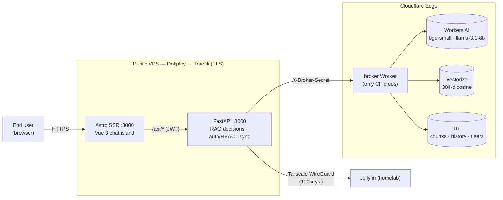
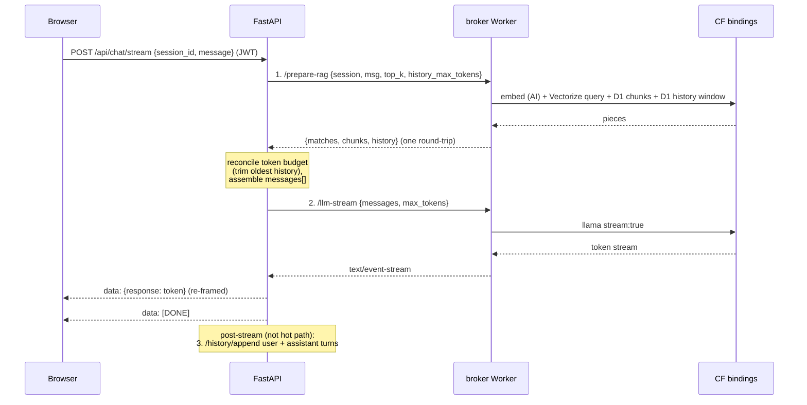
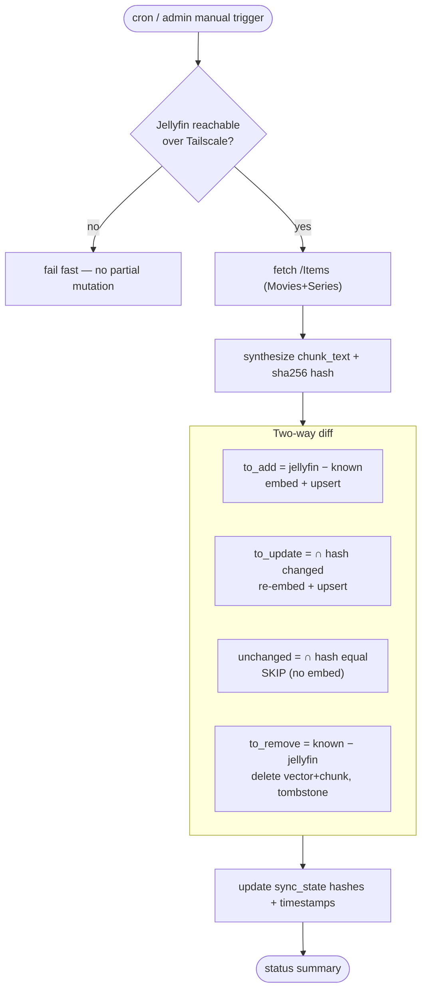

# JellieRAG: RAG System for Jellyfin Media Server with Role Based Access Control (RBAC)

> A self-hosted, privacy-conscious **Retrieval-Augmented Generation** assistant for your
> Jellyfin media library. Ask natural-language questions about your movies and series;
> get streaming answers with click-to-play deep links — without ever exposing your homelab
> to the public internet.

JellieRAG ingests Jellyfin metadata, embeds it into a **Cloudflare Vectorize** semantic
index, and answers questions through a streaming chat UI powered by **Cloudflare Workers AI**.
The homelab stays behind Tailscale; inference and vector search run on Cloudflare's edge.

---

## Table of contents

- [Why JellieRAG](#why-jellirag)
- [How it works (the 60-second version)](#how-it-works-the-60-second-version)
- [Architecture](#architecture)
- [Repository structure](#repository-structure)
- [Prerequisites](#prerequisites)
- [Development](#development)
- [Environment variables](#environment-variables)
- [API reference](#api-reference)
- [Data model](#data-model)
- [Security model](#security-model)
- [Deployment](#deployment)
- [Operations](#operations)
- [Verification checklist](#verification-checklist)
- [Project status & contributing](#project-status--contributing)

---

## Why JellieRAG

Three architectural principles shape everything:

1. **No Cloudflare credential ever resides on the VPS.** A thin credentials-broker Worker is
   the *only* component that touches Cloudflare. The VPS holds just the Jellyfin API key and one
   rotatable broker secret. A full VPS compromise exposes neither the Cloudflare account nor its resources.
2. **Reads fuse on the edge; decisions stay in Python.** The chat hot path is **two** broker calls
   (`/prepare-rag` + `/llm-stream`), not five — keeping time-to-first-token low while leaving all
   budgeting, message assembly, and policy in FastAPI.
3. **Deep links fail closed.** Click-to-play links are rooted at a Tailscale/MagicDNS address. On
   the Tailnet they resolve; off it the hostname is NXDOMAIN — so recommending media requires no
   public homelab port.

---

## How it works (the 60-second version)

1. **Sync** fetches Jellyfin items over Tailscale, synthesizes a text chunk for each, embeds it,
   and upserts the vector (Cloudflare Vectorize) + chunk text (Cloudflare D1). It's **incremental** —
   a content-hash diff re-embeds only new/changed items and prunes removed ones.
2. **Chat** asks a question. FastAPI calls the broker once to fuse *embed query → vector search →
   fetch chunk text → load conversation history*, reconciles a token budget, then calls the broker
   again to stream the LLM answer back to the browser as SSE.
3. **History** is private per user (`sessions.owner_email`), persisted in D1, and pruned on a TTL.

---

## Architecture

### Topology



### Responsibility split

| Component | Owns | Does **not** do |
|---|---|---|
| **broker** (Worker, TS) | Holds CF bindings/secrets; input validation; fused reads (`/prepare-rag`); chunked D1/Vectorize batches | Budget/policy decisions; password hashing/verification; role interpretation |
| **backend** (FastAPI, Python) | All RAG decisions: budget reconciliation, message assembly, deep-link templating, incremental sync, session prune, login/JWT, RBAC, argon2id hashing, account provisioning | Talks to `api.cloudflare.com` directly (only via broker) |
| **frontend** (Astro + Vue 3) | SSR shell, login page, reactive streaming chat island, source chips, admin UI | Holds any CF credential |

### Chat request — two broker calls



### Incremental library sync — two-way set difference



> `to_remove = known_ids − jellyfin_ids` is the step that catches media **deleted** from Jellyfin.
> Iterating only Jellyfin's response would silently miss deletions.

---

## Repository structure

```
jellirag/
├── apps/
│   ├── backend/                 # Python (uv) — FastAPI: RAG decisions + auth + sync
│   │   ├── pyproject.toml
│   │   ├── Dockerfile
│   │   ├── .dev.env.example
│   │   └── app/
│   │       ├── main.py              # FastAPI app + lifespan (shared clients, scheduler, bootstrap)
│   │       ├── config/settings.py   # env → Settings
│   │       ├── routers/             # auth · chat · history · admin · sync
│   │       ├── services/            # broker_client · jellyfin_client · sync_service · chunks · prompts · sse · scheduler · bootstrap
│   │       ├── budget/manager.py    # context-budget manager
│   │       └── security/            # jwt · passwords (argon2id) · deps (principal, RBAC, rate limit)
│   ├── frontend/               # pnpm — Astro SSR + Vue 3 islands
│   │   ├── astro.config.mjs        # @astrojs/vue + @astrojs/node (standalone)
│   │   ├── Dockerfile
│   │   └── src/{pages,layouts,components,lib}/
│   └── broker/                 # pnpm — Hono on Cloudflare Workers (TypeScript)
│       ├── wrangler.jsonc           # bindings: AI · INDEX(Vectorize) · DB(D1)
│       ├── provision.sh             # operator CF provisioning script
│       ├── migrations/0001_initial_schema.sql
│       └── src/
│           ├── index.ts             # Hono app + auth middleware + error handling
│           ├── env.ts limits.ts security.ts db.ts history.ts ai.ts lib.ts
│           └── routes/              # rag · history · ingest · sync · sessions · users
├── deploy/
│   └── docker-compose.yml       # Dokploy stack: frontend :3000 + backend :8000 + Traefik labels
├── packages/                    # shared workspace (minimal for MVP)
├── openspec/                    # change tracking (jellirag-mvp)
└── PRD.md                       # canonical product + technical reference
```

---

## Prerequisites

| Tool | Used by | Install |
|---|---|---|
| **Node.js** ≥ 22 + **pnpm** ≥ 9 | broker, frontend | <https://nodejs.org>, `corepack enable` |
| **Python** ≥ 3.12 + **uv** | backend | <https://docs.astral.sh/uv/> |
| **Wrangler** ≥ 4 (dev dependency) | broker deploy | ships with `apps/broker` |
| **Cloudflare account** | broker, Vectorize, D1, Workers AI | <https://dash.cloudflare.com> |
| **Tailscale** | VPS↔homelab overlay + MagicDNS deep-link base | <https://tailscale.com> |
| **Dokploy** (or Docker + Traefik) | VPS hosting | <https://dokploy.com> |
| A **Jellyfin** server reachable over Tailscale | media source | <https://jellyfin.org> |

---

## Development

Run the three services locally. The broker can run via `wrangler dev`; the backend talks to it
and to Jellyfin; the frontend talks to the backend.

### 1. broker (Cloudflare Worker)

```bash
cd apps/broker
pnpm install

# Local dev (miniflare). Create .dev.vars with a local secret:
cp .dev.vars.example .dev.vars      # BROKER_SECRET=dev-only-not-a-real-secret
pnpm dev                            # wrangler dev → http://localhost:8787

# Type-check
npx tsc --noEmit
```

> `wrangler dev` uses the configured bindings in `wrangler.jsonc`. For live bindings you must have
> run provisioning (see [Deployment](#deployment)) and filled in the D1 `database_id`.

### 2. backend (FastAPI)

```bash
cd apps/backend
uv sync

cp .dev.env.example .env                # fill in BROKER_URL, BROKER_SECRET, JELLYFIN_*, JWT_SECRET, …

uv run uvicorn app.main:app --reload --port 8000
# health check:
curl http://localhost:8000/healthz   # → {"status":"ok"}
```

On startup the app:
- creates a shared `httpx.AsyncClient` for all outbound HTTP (fully async),
- runs the idempotent **bootstrap-admin** hook (seeds an admin only if the `users` table is empty
  and `BOOTSTRAP_ADMIN_EMAIL`/`BOOTSTRAP_ADMIN_PASSWORD` are set),
- starts the APScheduler jobs (cron sync + daily prune).

### 3. frontend (Astro + Vue)

```bash
cd apps/frontend
pnpm install

# Point the browser at the backend origin (empty = relative/same-origin):
export PUBLIC_API_BASE=http://localhost:8000
export PUBLIC_DEEPLINK_BASE=http://jellyfin.<tailnet>.ts.net:8096

pnpm dev                            # http://localhost:3000
pnpm build                          # SSR build → dist/server/entry.mjs
```

### Useful local checks

```bash
# Broker type-check + dry-run build (validates wrangler.jsonc + bindings)
cd apps/broker && npx tsc --noEmit && npx wrangler deploy --dry-run

# Backend byte-compile + import smoke test
cd apps/backend && uv run python -m compileall -q app
cd apps/backend && uv run python -c "from app.main import app; print('ok')"

# Frontend production build
cd apps/frontend && pnpm build
```

---

## Environment variables

All secrets are injected at runtime (Dokploy encrypted env / Wrangler Secrets) — **never** baked
into images or committed. No Cloudflare credential belongs on the VPS.

### backend — `apps/backend/.env`

| Variable | Required | Default | Purpose |
|---|---|---|---|
| `BROKER_URL` | yes | — | broker Worker origin |
| `BROKER_SECRET` | yes | — | pre-shared secret sent as `X-Broker-Secret` |
| `JELLYFIN_TAILSCALE_URL` | yes | — | Jellyfin base over Tailscale (`http://100.x.y.z:8096`) |
| `JELLYFIN_API_KEY` | yes | — | Jellyfin API key (homelab-scoped, rotatable) |
| `JELLYFIN_DEEPLINK_BASE` | yes | — | Tailscale/MagicDNS base for click-to-play links |
| `JWT_SECRET` | yes | — | HS256 signing secret for JWTs |
| `JWT_TTL_DAYS` | no | `7` | JWT lifetime |
| `SESSION_TTL_DAYS` | no | `30` | session-inactivity TTL (`0` disables pruning) |
| `FRONTEND_ORIGIN` | no | — | CORS allow-list (comma-separated exact origins) |
| `BOOTSTRAP_ADMIN_EMAIL` | no | — | one-shot admin seed (used only if `users` empty) |
| `BOOTSTRAP_ADMIN_PASSWORD` | no | — | one-shot admin seed password |
| `LOGIN_MAX_ATTEMPTS` | no | `10` | per-email login attempt ceiling |
| `LOGIN_WINDOW_SECONDS` | no | `600` | login rate-limit window |
| `SYNC_CRON` | no | `0 3 * * *` | cron expression for scheduled sync (UTC) |

### broker — Wrangler Secrets / `.dev.vars`

| Variable | Required | Purpose |
|---|---|---|
| `BROKER_SECRET` | yes | shared secret validated on every request (constant-time compare) |

Bindings are declared in `wrangler.jsonc`: `AI`, `INDEX` (Vectorize), `DB` (D1).

### frontend — build-time (Astro `PUBLIC_`)

| Variable | Default | Purpose |
|---|---|---|
| `PUBLIC_API_BASE` | `""` (relative) | backend origin the browser calls |
| `PUBLIC_DEEPLINK_BASE` | `""` | Tailnet base for source-chip deep links |

---

## API reference

All `/api/*` routes (except `/api/auth/login`) require a `Authorization: Bearer <jwt>` header.
The broker requires `X-Broker-Secret` on every domain operation.

### Backend (FastAPI) — public

| Method | Path | Role | Description |
|---|---|---|---|
| `POST` | `/api/auth/login` | public | `{email,password}` → `{token,role,email}` (argon2id verify; identical-timing 401) |
| `POST` | `/api/chat/stream` | member | `{session_id,message}` → `text/event-stream` (`data: {response}` then `data: [DONE]`) |
| `GET` | `/api/history/{session_id}?max_tokens=` | member | owner-scoped conversation window |
| `POST` | `/api/sync` | admin | manual library sync → status summary |
| `POST` | `/api/sessions/prune` | admin | TTL prune of inactive sessions (+ messages) |
| `GET` | `/api/admin/users` | admin | list accounts (no `pw_hash`) |
| `POST` | `/api/admin/users` | admin | create user `{email,password,role}` |
| `PUT` | `/api/admin/users/{email}` | admin | role change / password reset |
| `DELETE` | `/api/admin/users/{email}` | admin | delete user (cascades to sessions + messages) |
| `GET` | `/healthz` | public | liveness |

### broker (Worker) — internal, `X-Broker-Secret` required

| Method | Path | Description |
|---|---|---|
| `POST` | `/prepare-rag` | **hot path** — fused: embed + Vectorize query + D1 chunks + history window |
| `POST` | `/search` | fused embed + Vectorize query |
| `POST` | `/embed` | `bge-small-en-v1.5` embeddings |
| `POST` | `/chunks` | D1 chunk read by `jf_id` list |
| `POST` | `/llm-stream` | llama-3.1-8b-instruct-fast SSE (requires explicit `max_tokens`) |
| `POST` | `/history/read` · `/history/append` | owner-scoped history (append upserts session + bumps `last_active_at`) |
| `POST` | `/ingest/upsert` · `/ingest/delete` | Vectorize upsert/delete + D1 chunks (batched) |
| `GET` · `PUT` | `/sync/state` | read/overwrite incremental-sync bookkeeping |
| `POST` | `/sessions/prune` | cascade-delete inactive sessions (+ messages) |
| `POST` | `/users/lookup` · `/create` · `/list` · `/update` · `/delete` | D1 users (stores opaque `pw_hash`; **never** verifies passwords) |

**Platform limits enforced by the broker** (→ `400` on violation, transparent chunking where
batchable): `top_k ≤ 20`, `jf_id ≤ 64 bytes`, `filter < 2048 bytes`, embedding input ≤ ~512 tokens,
D1 statements ≤ 100 bound params, Vectorize upserts ≤ 1000 vectors.

---

## Data model

All tables live in one **Cloudflare D1** (SQLite) database. Schema:
[`apps/broker/migrations/0001_initial_schema.sql`](apps/broker/migrations/0001_initial_schema.sql).

| Table | PK | Purpose |
|---|---|---|
| `chunks` | `jf_id` | full chunk text + `content_hash` (Vectorize holds only slim metadata) |
| `sync_state` | `jf_id` | incremental-sync bookkeeping (`deleted_at` tombstone) |
| `users` | `email` | app-owned accounts; `role ∈ {admin, member}`; opaque argon2id `pw_hash` |
| `sessions` | `session_id` | conversations; `owner_email` scopes every read/append |
| `messages` | `(session_id, seq)` | append-only history; `role ∈ {system, user, assistant}` |

**Cascade policy:** `users ──(CASCADE)──▶ sessions ──(CASCADE)──▶ messages`. D1 enforces foreign
keys by default, so `ON DELETE CASCADE` works automatically (no per-connection PRAGMA). Deleting a
user or pruning a session sweeps dependent rows.

**Vectorize metadata** is intentionally slim: `{ jf_id, title, year, genre }`. Full text lives in
D1, keeping vectors filter-friendly and within size limits (and leaving room for future FTS5 hybrid
search without re-ingestion).

---

## Security model

- **Credential isolation (NFR-3).** Only the `broker` Worker holds Cloudflare credentials
  (Workers Secrets). The VPS holds only `JELLYFIN_API_KEY` + `BROKER_SECRET` (+ non-secret config),
  in Dokploy encrypted env. Blast radius of VPS compromise: a rotatable homelab key + a rotatable
  broker secret — **not** the Cloudflare account.
- **Network isolation (NFR-2).** VPS↔homelab over Tailscale WireGuard; zero public homelab ports.
  Public ingress is HTTPS-only (Traefik TLS + HTTP→HTTPS redirect).
- **App-owned auth + RBAC.** No Cloudflare Access for MVP — FastAPI verifies passwords (argon2id)
  and issues JWTs (`{sub, role, exp}`, signed with `JWT_SECRET`). Two roles: `admin` (sync, prune,
  account provisioning) and `member` (chat, own history). Dropping CF Access loses its MFA/abuse
  shielding; the trade-off is accepted for ≤ ~3 trusted family users and mitigated by argon2id,
  strict CORS, HTTPS-only ingress, and per-email login rate limiting. CF Access may be re-layered
  in front of the hostname later without code changes.
- **Private history.** `sessions.owner_email` is taken from the caller's JWT — never the request
  body — so a member can't read another member's session even by guessing a `session_id`
  (cross-owner access behaves as "new session").
- **Broker hardening.** Constant-time secret compare (`401` on mismatch), input validation +
  size limits on every endpoint (`400`), domain operations only (no raw SQL passthrough). The
  broker stores/returns the opaque `pw_hash` but performs **no** password verification or role
  interpretation — all policy lives in FastAPI.
- **Fail-closed deep links.** Links root at the Tailnet base; off-network the hostname is NXDOMAIN,
  so recommending media needs no public homelab port. The UI shows a "requires Tailscale" affordance.

---

## Deployment

### A. Provision Cloudflare resources (one-time)

```bash
cd apps/broker
wrangler login
./provision.sh
```

`provision.sh` runs the operator infra steps:

1. `wrangler vectorize create jellyfin-index --dimensions=384 --metric=cosine`
2. `wrangler d1 create jellyrag` → **copy the printed `database_id` into `wrangler.jsonc`**
3. apply [`migrations/0001_initial_schema.sql`](apps/broker/migrations/0001_initial_schema.sql) to remote D1
4. `wrangler secret put BROKER_SECRET` (generate with `openssl rand -base64 32`)
5. verify the `@cf/meta/llama-3.1-8b-instruct-fast` model slug + its max input tokens (OQ-1)

Then deploy the Worker:

```bash
cd apps/broker
pnpm deploy                      # wrangler deploy --minify
```

### B. Deploy the VPS stack (Dokploy)

The [`deploy/docker-compose.yml`](deploy/docker-compose.yml) defines two services behind Traefik:

- **frontend** (Astro SSR) on `:3000`
- **backend** (FastAPI) on `:8000`

with auto-TLS (`letsencrypt` resolver) and an HTTP→HTTPS redirect on the plaintext entrypoint.
Set the `${...}` variables in the Dokploy UI (encrypted env) — the compose file lists exactly what
each service needs. Per-app Dockerfiles live at `apps/frontend/Dockerfile` and `apps/backend/Dockerfile`.

### C. Bring up the overlay + seed an admin

1. Install Tailscale on the VPS; enable MagicDNS; name the Jellyfin host.
2. Verify reachability: `curl -I http://<jellyfin-host>.<tailnet>.ts.net:8096/web/index.html`
3. On FastAPI startup, the `ensure-bootstrap-admin` hook seeds the first admin **only if** the
   `users` table is empty and `BOOTSTRAP_ADMIN_EMAIL`/`BOOTSTRAP_ADMIN_PASSWORD` are set.
4. Log in as the admin and provision the ≤ ~2 family member accounts from the **Admin** UI.
5. Trigger a manual **full sync** (`POST /api/sync` or the admin UI), then chat.

### Migration plan / rollback

Greenfield — no data to migrate. Rollback: disable the public hostname; the broker Worker and VPS
containers are independently stoppable. No shared mutable state outside Cloudflare + D1, so rollback
is clean.

---

## Operations

### Library sync

- **Automated:** APScheduler runs `run_library_sync` on `SYNC_CRON` (default `0 3 * * *` UTC).
- **Manual (admin):** `POST /api/sync` returns `{total, added, updated, unchanged, removed, errors}`.
- Embedding calls are paced under the Workers AI embeddings rate ceiling (~3,000 req/min for
  `bge-small-en-v1.5`; confirm against your plan) with bounded concurrency + 429 backoff.
  Steady-state runs are incremental — a handful of items, no full re-embed.

### Session pruning

- A daily job (04:15 UTC) prunes `sessions` whose `last_active_at` is older than `SESSION_TTL_DAYS`
  (default 30). `SESSION_TTL_DAYS=0` disables pruning. Manual: `POST /api/sessions/prune` (admin).
- Whole inactive sessions only — an active conversation never loses mid-session history.

### Secret rotation (all independent)

| Rotate | How | Invalidates |
|---|---|---|
| `BROKER_SECRET` | `wrangler secret put` **and** Dokploy env (both sides) | broker access from VPS until both updated |
| `JELLYFIN_API_KEY` | Dokploy env only | sync until updated |
| `JWT_SECRET` | Dokploy env + FastAPI restart | all outstanding JWTs (users must re-login) |

Rotating any VPS-side secret touches **no** Cloudflare credential.

---

## Verification checklist

- [ ] `wrangler vectorize info` shows 384 / cosine.
- [ ] Wrong broker secret → `401`; bad/oversized request → `400`.
- [ ] Missing / expired / tampered JWT on `/api/*` → `401`.
- [ ] `member` calling sync / prune / `/api/admin/users/*` → `403`.
- [ ] Cross-owner history access behaves as "new session" (no leak).
- [ ] `/users/lookup` returns a `pw_hash` but performs no verification; `/users/list` returns none.
- [ ] Unreachable Jellyfin → fail-fast, no partial Vectorize/D1 mutation.
- [ ] Off-Tailnet deep link → NXDOMAIN (fail-closed).
- [ ] Chat hot path = exactly two broker calls (`/prepare-rag` + `/llm-stream`).
- [ ] TTFT measured (target < 800 ms); record a baseline.

---

## Project status & contributing

This MVP is tracked as OpenSpec change **`jellirag-mvp`** under `openspec/`. The authoritative
product + technical reference is [`PRD.md`](PRD.md); testable per-capability requirements live in
`openspec/changes/jellirag-mvp/specs/{rag-chat,library-sync,broker,edge-security,auth}/spec.md`.

**Tooling by app:** `apps/backend` (uv), `apps/frontend` + `apps/broker` (pnpm). Please keep changes
minimal and scoped, follow the existing patterns in each app, and run the local checks above before
submitting. Never commit secrets — `.env`, `.dev.vars`, and credentials are gitignored.

### Out of scope (deferred)

- **RAG decisions in the Worker** — broker may batch reads, but budget/policy stay in FastAPI
  (documented escape hatch if the TTFT target proves infeasible).
- **Hybrid (semantic + FTS5) search** — schema leaves room; not wired for MVP.
- **Multi-user at scale / per-session Durable Objects** — right-sized to ≤ ~3 family users; migrate
  conversation state to a DO per session if the user set grows.
- **Self-service signup / fine-grained permission matrices** — admin-provisioned accounts + two
  roles suffice for a family deployment.
